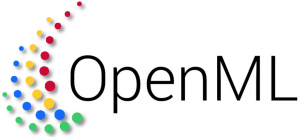

Hi! I am a Ph.D. student at the Univeristy of British Columbia (UBC) CS advised by [Vered Shwartz](https://www.cs.ubc.ca/~vshwartz/) and [Raymond NG](https://www.cs.ubc.ca/people/raymond-ng) in the [Natural Language Processing group](http://www.cs.ubc.ca/cs-research/lci/research-groups/natural-language-processing/). I frequently collaborate with [Leonid Sigal](https://www.cs.ubc.ca/~lsigal/) in the Computer Vision group.

The goal of my research is to develop robust and safe AI models that move beyond pattern recognition to achieve a deeper, context-sensitive understanding of the world. Specifically, I evaluate and improve critical reasoning capabilities across multiple modalities (text, images, videos) - which are fundamental for safe and effective deployment in real-world applications.

My focus is on the following interconnected areas:

➊ **Robustness to Expectation-Violating Video Events**  
I design benchmarks and models that adapt to surprising or expectation-violating events, which is crucial for **real-world safety**. 
My recent work [Black Swan](https://blackswan.cs.ubc.ca/) evaluates models on abductive and defeasible reasoning in unpredictable video settings, testing whether models can revise their beliefs when presented with new evidence. I am currently working on adapting models to be resilient to such scenarios.

➋ **Feedback Driven Learning**  
To scale complex reasoning capabilities such as creativity, which do not adhere to a step-by-step reasoning paradigm, I have worked on [feedback-driven iterative DPO](https://aclanthology.org/2024.acl-long.706.pdf) and showed that it improves performance. I am currently exploring the role of multi-aspect feedback in improving such generation.

➌ **Grounded Reasoning**  
I have developed models that infer real-world events and object dynamics using world knowledge. This includes reasoning over interconnected events in [text](https://aclanthology.org/2023.findings-emnlp.861.pdf), [event coreference](https://aclanthology.org/2023.eacl-main.125), and grounded vision-language understanding [models](https://openaccess.thecvf.com/content/WACV2023/papers/Ravi_VLC-BERT_Visual_Question_Answering_With_Contextualized_Commonsense_Knowledge_WACV_2023_paper.pdf). 

➍ **Inclusive Models**  
I have worked on valuating vision-language models in [multicultural settings](https://aclanthology.org/2024.emnlp-main.385/) and benchmarking the understanding of cultural norms in LLMs ([CulturalBench](https://arxiv.org/abs/2410.02677)).

If you are interested in any of the above areas, feel free to reach out. 

<!-- Before coming to UBC, I worked as an AI research engineer in the Machine Learning group at Eindhoven University of Technology. Together with an amazing [team](https://github.com/orgs/openml/people) supervised by [Joaquin Vanschoren](https://joaquinvanschoren.github.io/home/#lab) I worked on research and development of open-source software for [open and automated machine learning](https://github.com/openml). I also worked with [Mykola Pechenizkiy](https://www.win.tue.nl/~mpechen/) on active learning and interpretability of NLP models. Prior to that, I graduated from M.Sc. in Mathematics and Computer Science at Eindhoven University of technology, the Netherlands, and B.E. in Computer Engineering from PSG college of Technology, Coimbatore, India.  -->

# Experience

  <!-- Experience 1 -->
  

    
Summer 2024

    

      
      

        <h3>Research Intern, FAIR Communication and Language</h3>
          
Generating fine-grained facial expressions using semantically meaningful pose tokens, improving predictability and precise control crucial for controllable video generation. 

      

    

  

  <!-- Experience 2 -->
  

    
Summer 2024

    

      
      

        <h3>Research Intern, Microsoft Research, HCAIX Group</h3>
        
Evaluating 3D spatial reasoning abilities of Vision Language Models in ego-centric videos.

      

    

  

  <!-- Experience 3 -->
  

    
Summer 2023

    

      
      

        <h3>AI Research Scientist Intern, Meta Reality Labs</h3>
        
 Iterative-DPO and ranking methods for teaching creative abilities to smaller LMs.

      

    

  

<!-- Experience 5 -->

  
2019 - 2021

  

    
    

      <h3>AI Research Engineer, OpenML & TU/e</h3>
      

        I worked as an AI research engineer in the Machine Learning group at Eindhoven University of Technology. 
        Together with an amazing <a href="https://github.com/orgs/openml/people">team</a> supervised by 
        <a href="https://joaquinvanschoren.github.io/home/#lab">Joaquin Vanschoren</a>, I worked on research and development of open-source software for 
        <a href="https://github.com/openml">open and automated machine learning</a>. I also worked with 
        <a href="https://www.win.tue.nl/~mpechen/">Mykola Pechenizkiy</a> on active learning and interpretability of NLP models.
      

    

  

