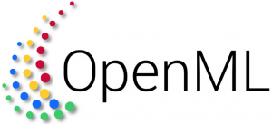

  <!-- Experience 1 -->
  

    
Summer 2024

    

      
      

        <h3>Research Intern, FAIR Communication and Language</h3>
        <ul>
          <li>Text-guided avatar generation based on social norms</li>
        </ul>
      

    

  

  <!-- Experience 2 -->
  

    
Summer 2024

    

      
      

        <h3>Research Intern, Microsoft Research, HCAIX Group</h3>
        <ul>
          <li>Evaluating spatial reasoning abilities of Vision Language Models across multiple frames</li>
        </ul>
      

    

  

  <!-- Experience 3 -->
  

    
Summer 2023

    

      
      

        <h3>AI Research Scientist Intern, Meta Reality Labs</h3>
        <ul>
          <li>Distillation from Large Language Models (LLMs) to Small Language Models (SLMs)</li>
        </ul>
      

    

  

  <!-- Experience 4 -->
  

    
2021 - Present

    

      
      

        <h3>Research Assistant, UBC NLP Group</h3>
        <ul>
          <li>Commonsense, abductive, and counterfactual reasoning in Vision Language tasks</li>
        </ul>
      

    

  

  <!-- Experience 5 -->
  

    
2019 - 2021

    

      
      

        <h3>AI Research Engineer, OpenML & TU/e</h3>
        <ul>
          <li>Core developer for OpenML and AutoML research infrastructure</li>
          <li>Developed meta-learning approaches for AutoML experiment selection</li>
        </ul>
      

    

  

